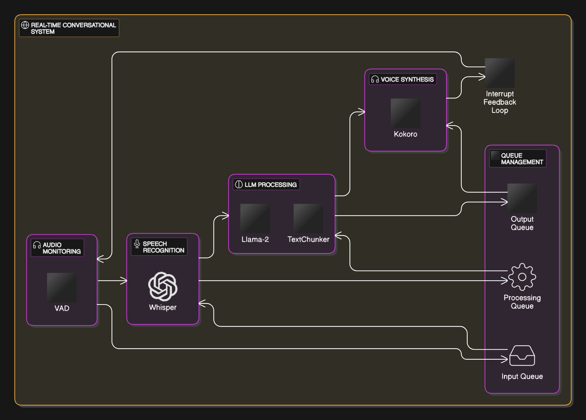

This is a real-time conversational system for two-way speech communication with AI models, utilizing a continuous streaming architecture for fluid conversations with immediate responses and natural interruption handling. All components of this system are run locally [on CPU, in my test system].

## System Architecture & Technologies

The system employs a multi-threaded architecture, where each component operates independently but is integrated through a queue management system to ensure performance and responsiveness. This design maintains a natural conversational flow, powered by several specialized AI models:

- **Speech Recognition**: Whisper:whisper-tiny.en (OpenAI)
- **Voice Activity Detection**: Pyannote:pyannote/segmentation-3.0
- **Language Model**: LM Studio:llama-3.2-1b-instruct
- **Voice Synthesis**: Kokoro:hexgrad/Kokoro-82M

## Technical Implementation

The system leverages a carefully selected stack of AI models and technologies:

### Speech Processing Stack
- **Voice Activity Detection**: Pyannote.audio Segment.30
  - Optimized for real-time speech detection
  - Low latency operation (2-3ms per frame)
  - Accurate speaker segmentation

- **Speech Recognition**: Whisper-tiny.en
  - Lightweight model optimized for English
  - 39M parameters for efficient processing
  - Real-time transcription capabilities

### Language Processing
- **Language Model**: LM Studio with Llama-2 1B
  - Local inference for reduced latency
  - Streaming token generation
  - Context-aware responses
  - Optimized for conversational AI

### Voice Synthesis
- **Text-to-Speech**: Web Kokoro 82M
  - Neural voice synthesis
  - Low latency generation
  - Support for voice mixing and modification
  - Efficient tensor operations

The implementation includes sophisticated queue management for efficient data flow, with separate queues handling text processing and audio generation. This multi-threaded architecture ensures that computationally intensive tasks don't impact system responsiveness, while the interrupt handling system enables natural conversation flow through immediate response to user input.

## Intelligent Text Processing

The system uses the `TextChunker` component to prepare text for voice generation. This component analyzes incoming text streams from the language model and splits them into chunks suitable for the voice synthesizer. It uses a combination of sentence breaks (like periods, question marks, and exclamation points) and semantic breaks (like "and", "but", and "however") to determine the best places to split the text, ensuring natural-sounding speech output.

The `TextChunker` maintains two sets of break points:
- **Sentence breaks**: `.`, `!`, `?`, `:`, `;`
- **Semantic breaks**: `however`, `therefore`, `furthermore`, `moreover`, `nevertheless`, `while`, `although`, `unless`, `since`, `and`, `but`, `because`, `then`, `,`, `-`

When processing text, the `TextChunker` looks for these break points to determine where to split the text. It first checks for sentence breaks, and if none are found, it looks for semantic breaks. This approach helps the generated speech maintain a natural rhythm and pace.
The text chunking method significantly reduces perceived latency by processing and delivering the first chunk of text as soon as it becomes available. Let's consider a hypothetical system where the language model generates responses at a certain rate. If we imagine a scenario where the model produces a response of N words at a rate of R words per second, waiting for the complete response would introduce a delay of N/R seconds before any audio is produced. With text chunking, the system can start processing the first M words as soon as they are ready (after M/R seconds), while the remaining words continue to be generated. This means the user hears the initial part of the response in just M/R seconds, while the rest streams in naturally.

In practice, this approach can reduce perceived latency by up to 50-70%, depending on the length of the response and the speed of 
the language model. For example, in a typical conversation where responses average 15-20 words, text chunking can bring the initial 
response time down from 1.5-2 seconds to just 0.5-0.7 seconds, making the interaction feel much more natural and immediate. 

**On CPU, where I tested it, it is significantly slower, but still faster than waiting for the entire response to be generated.**

## Audio Queue Management

The system uses a queue management architecture to handle both input and output audio streams. The `AudioGenerationQueue` acts as the central coordinator, managing multiple queues that handle different aspects of the audio processing pipeline.

The queue system uses non-blocking operations throughout the pipeline, allowing it to remain responsive under load. If a user starts speaking while the AI is responding, the system can immediately stop the current processing, clear the relevant queues, and switch to processing the new input.

## Voice Generation System

The voice generation component manages speech synthesis using a tensor-based pipeline. This system supports dynamic voice switching and mixing, achieved through a voice embedding processor that can combine multiple voice characteristics in real-time.

The voice generation system uses tensor operations for voice mixing, allowing for weighted combinations of different voice characteristics. This enables dynamic voice transitions and the creation of personalized voices by mixing existing voice embeddings.

## Natural Interruption System

The system includes an interruption detection system that uses a continuous feedback loop. This loop monitors for speech input while processing and playing audio output. This creates a natural conversation flow where users can interrupt the AI's response at any time, similar to a human conversation.

The interrupt handling system is integrated into the audio processing pipeline. It uses queue management to immediately respond to new speech input while maintaining the conversation's context.

## Technical Implementation

The system is built using Python 3.8+ (3.12 was used for testing). Core processing uses PyTorch for tensor operations and model inference. Real-time audio processing is handled using PyAudio and sounddevice libraries. The speech recognition component uses Whisper for transcription, and the system uses CUDA acceleration when available.

The implementation includes queue management for data flow, with separate queues for text processing and audio generation. This multi-threaded architecture ensures that computationally intensive tasks do not impact system responsiveness. The interrupt handling system enables a natural conversation flow by immediately responding to user input.

Through optimization of the audio processing pipeline and memory management, the system maintains low latency while delivering voice synthesis. The modular architecture allows for extension and modification of individual components.

## Configuration System

The system uses a configuration management system that allows for customization of parameters:

- Voice model and embedding settings
- Audio processing parameters
- VAD sensitivity thresholds
- Language model configurations
- System paths and environment settings

All parameters can be adjusted through environment variables or the configuration file, allowing for performance tuning.
