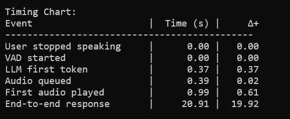

This is a real-time conversational system for two-way speech communication with AI models, utilizing a continuous streaming architecture for fluid conversations with immediate responses and natural interruption handling. All components of this system are run locally [on CPU, in my test system].

<h2 style="color: yellow;">HOW TO RUN IT</h2>

1. **Prerequisites:**
   - Install Python 3.8+ (tested with 3.12)
   - Install [eSpeak NG](https://github.com/espeak-ng/espeak-ng/releases/tag/1.52.0) (required for voice synthesis)
   - Install Ollama from https://ollama.ai/

2. **Setup:**
   - Clone this repository `git clone https://github.com/On-Device-Speech-to-Speech-AI`
   - Run `git lfs pull` to download the models and voices
   - Copy `.env.template` to `.env`
   - Add your HuggingFace token to `.env`
   - Install requirements: `pip install -r requirements.txt`
   - Add any missing packages if not already installed `pip install <package_name>`

4. **Run Ollama:**
   - Start Ollama service
   - Run: `ollama run llama3.2:1b` or any other model of your choice

5. **Start Application:**
   - Run: `python speech_to_speech.py`
   - Wait for initialization (models loading)
   - Start talking when you see "Voice Chat Bot Ready"
   - Long press `Ctrl+C` to stop the application

We basically put a few models together to work in a multi-threaded architecture, where each component operates independently but is integrated through a queue management system to ensure performance and responsiveness.
### The flow works as follows: Loop (VAD -> Whisper -> LM -> TextChunker -> TTS)
To achieve that we use:

- **Voice Activity Detection**: Pyannote:pyannote/segmentation-3.0
- **Speech Recognition**: Whisper:whisper-tiny.en (OpenAI)
- **Language Model**: LM Studio/Ollama with Llama-2 1B
- **Voice Synthesis**: Kokoro:hexgrad/Kokoro-82M

We use custom text processing and queues to manage data, with separate queues for text and audio. This setup allows the system to handle heavy tasks without slowing down. We also use an interrupt mechanism allowing the user to interrupt the AI at any time. This makes the conversation feel more natural and responsive rather than just a generic TTS engine.

## Performance:

I ran this test on an AMD Ryzen 5600G, 16 GB, SSD, and No-GPU setup, achieving consistent ~2s latency. On average, it takes around 1.5s for the system to respond to a user query from the point the user says the last word. Although I haven't tested this on a GPU, I believe testing on a GPU would significantly improve performance and responsiveness.

## How do we reduce latency?
We capitalize on the streaming output of the language model to reduce latency. Instead of waiting for the entire response to be generated, we process and deliver each chunk of text as soon as they become available, form phrases, and send it to the TTS engine queue. We play the audio as soon as it becomes available. This way, the user gets a very fast response, while the rest of the response is being generated.

Our custom `TextChunker` analyzes incoming text streams from the language model and splits them into chunks suitable for the voice synthesizer. It uses a combination of sentence breaks (like periods, question marks, and exclamation points) and semantic breaks (like "and", "but", and "however") to determine the best places to split the text, ensuring natural-sounding speech output.

The `TextChunker` maintains a set of break points:
- **Sentence breaks**: `.`, `!`, `?` (highest priority)
- **Semantic breaks** with priority levels:
  - Level 4: `however`, `therefore`, `furthermore`, `moreover`, `nevertheless`
  - Level 3: `while`, `although`, `unless`, `since`
  - Level 2: `and`, `but`, `because`, `then`
- **Punctuation breaks**: `;` (4), `:` (4), `,` (3), `-` (2)

When processing text, the `TextChunker` uses a priority-based system:
1. Looks for sentence-ending punctuation first (highest priority 5)
2. Checks for semantic break words with their associated priority levels
3. Falls back to punctuation marks with lower priorities
4. Splits at target word count if no natural breaks are found

The text chunking system now uses this priority hierarchy to determine optimal break points, helping balance between natural speech flow and latency reduction. This matches the actual implementation in `TextChunker.find_break_point()`.

The text chunking method significantly reduces perceived latency by processing and delivering the first chunk of text as soon as it becomes available. Let's consider a hypothetical system where the language model generates responses at a certain rate. If we imagine a scenario where the model produces a response of N words at a rate of R words per second, waiting for the complete response would introduce a delay of N/R seconds before any audio is produced. With text chunking, the system can start processing the first M words as soon as they are ready (after M/R seconds), while the remaining words continue to be generated. This means the user hears the initial part of the response in just M/R seconds, while the rest streams in naturally.

In practice, this approach can reduce perceived latency by up to 50-70%, depending on the length of the response and the speed of
the language model. For example, in a typical conversation where responses average 15-20 words, text chunking can bring the initial
response time down from 1.5-2 seconds to just 0.5-0.7 seconds, making the interaction feel much more natural and immediate.

## Resources
This project utilizes the following resources:
*   **Text-to-Speech Model:** [Kokoro](https://huggingface.co/hexgrad/Kokoro-82M)
*   **Speech-to-Text Model:** [Whisper](https://huggingface.co/openai/whisper-tiny.en)
*   **Voice Activity Detection Model:** [Pyannote](https://huggingface.co/pyannote/segmentation-3.0)
*   **Large Language Model Server:** [Ollama](https://ollama.ai/)
*   **Fallback Text-to-Speech Engine:** [eSpeak NG](https://github.com/espeak-ng/espeak-ng/releases/tag/1.52.0)

## Acknowledgements
This project draws inspiration and guidance from the following articles and repositories, among others:
*   [Realtime speech to speech conversation with MiniCPM-o](https://github.com/OpenBMB/MiniCPM-o)
*   [A Comparative Guide to OpenAI and Ollama APIs](https://medium.com/@zakkyang/a-comparative-guide-to-openai-and-ollama-apis-with-cheathsheet-5aae6e515953)
*   [Building Production-Ready TTS with Kokoro-82M](https://medium.com/@simeon.emanuilov/kokoro-82m-building-production-ready-tts-with-82m-parameters-unfoldai-98e36ff286b9)
*   [Kokoro-82M: The Best TTS Model in Just 82 Million Parameters](https://medium.com/data-science-in-your-pocket/kokoro-82m-the-best-tts-model-in-just-82-million-parameters-512b4ba4f94c)
*   [StyleTTS2 Model Implementation](https://github.com/yl4579/StyleTTS2/blob/main/models.py)
